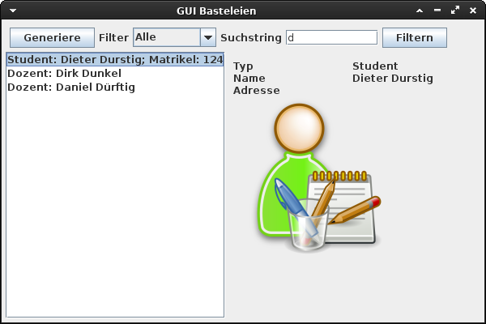

# School project

## Purpose
Demo project for usage of Interfaces for custom list models in Java SWING JList components.

## Content of the Repository
Different stages of the project are stored in different branches, where master is the initial stage.

## Basic Usage

Goal is filterable JList. The ComboBox is used to select the desired class. Items can be filtered by name using the search field.  
